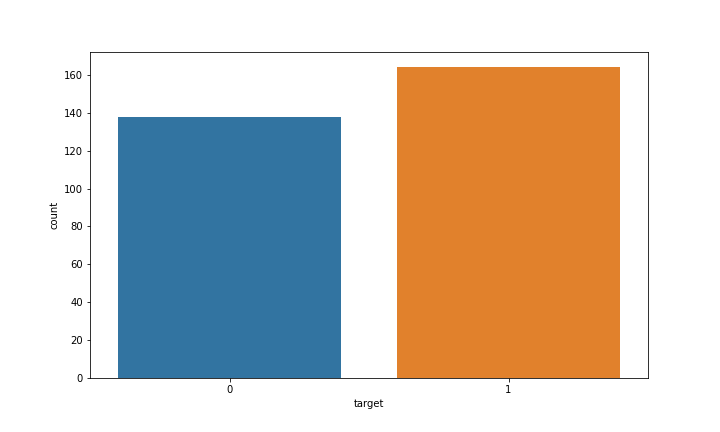
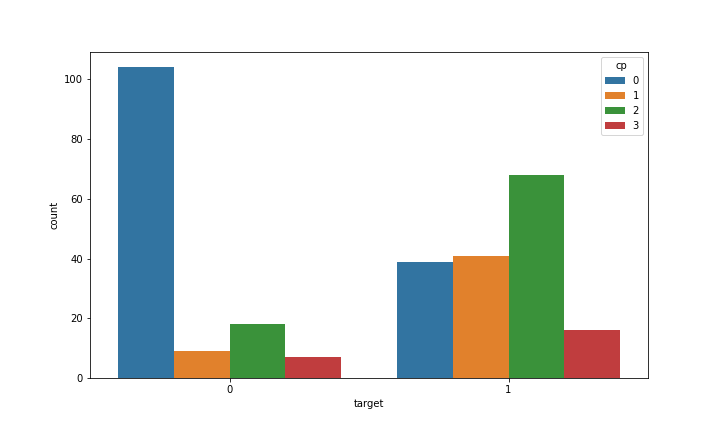

# Heart-Disease-Predictor
* A model was created that will estimate whether a patient has heart disease or not on the basis of given parameters.
* Used different classification models.
> RandomForestClassifier
> LogisticRegression
> SupportVectorClassifier
> KNN
> GaussinaNaiveBayes
> XGBoost
* Best model was selected on the basis of accuracy
* Data collected from https://archive.ics.uci.edu/ml/datasets/heart+Disease

# Code and Resources Used
> Python version : 3.8.3 Packages: pandas, numpy, matplotlib, seaborn, scikitlearn, pickle

# Problem Definition
> Given the datasets, detect whether the patient has heart disease or not?

# Tools
* Numpy - for numerical operations
* Pandas - for data analysis
* Matplotlib - for data visualization
* Seaborn - same use as Matplotlib with additional features
* Scikit-Learn(Sklearn) - for machine learning modelling

# Exploratory Data Analysis(EDA)
> Looking the correlation between different variable

> Seeing the target variable set(seeing whether datasets are balanced or not)

> Cp and target comparision

# Liscence
©️ ShyamStha 2020

# Creator
# ShyamStha
